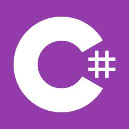
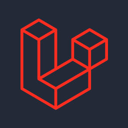
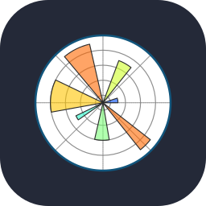
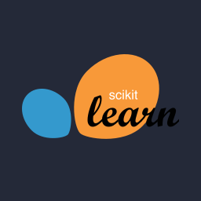

$ ls ./stack
<p>                                              </p> <br/>

## `$ postman run ./namasaiaicat`

```text
📁 namasaiaicat / collection
 ├─ GET     /planning
 ├─ GET     /tolong kerjakan...
 ├─ POST    /deploy
 └─ DELETE  /sleep
```

```http
GET {{baseUrl}}/profile
Accept: application/json
Authorization: Bearer {{token}}
```

```json
// 200 OK · 69 ms · 1.2 KB
{
  "user": "namasaiaicat",
  "philosophy": "live happily.",
  "status": "broke"
}
```

<br/>

## `$ 😂

```diff
# you
> build me a website, no mistakes 🙏

# claude
+ ✓ 12 files created
+ ✓ build success
- ✗ 47 errors found
! ↻ fixing... (attempt 99)
+ ✓ it works (don't touch it)
```

<br/>

## `$ git log --pinned`

<a href="https://github.com/namasaiaicat/9drive-drived">
  
</a>

<br/>

<div align="center">


</div>
